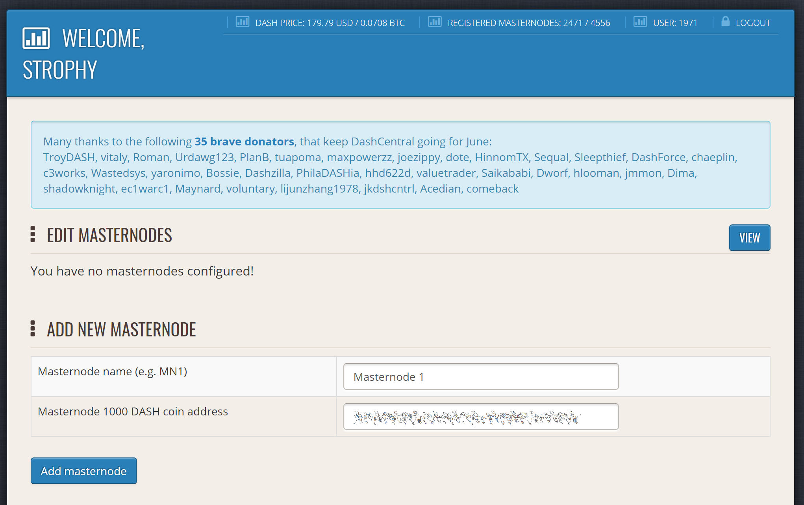
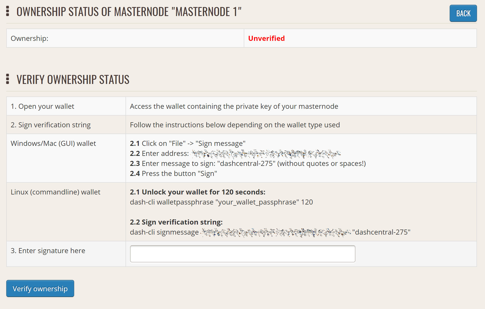
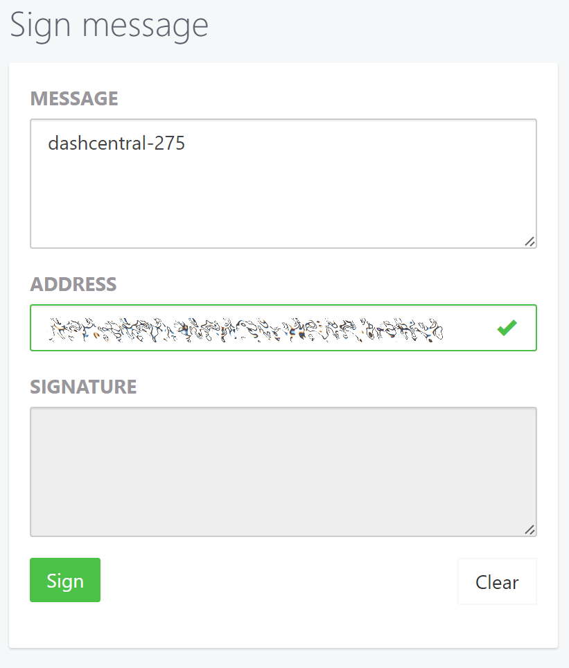
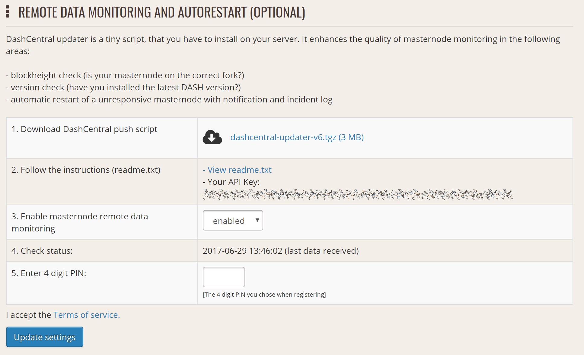
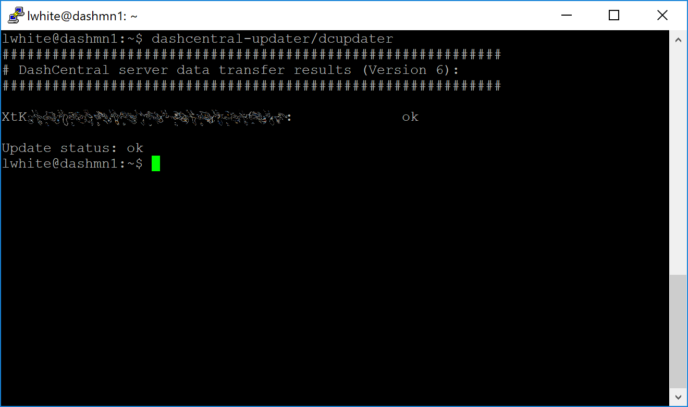
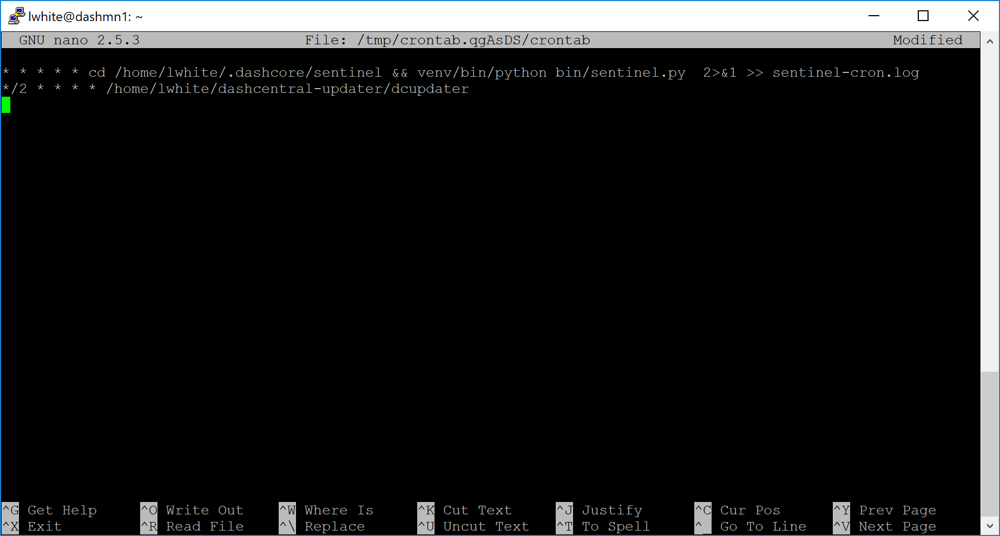

.. meta::
   :description: Maintaining a Axe masternode involves staying up to date with the latest version, voting and handling payments
   :keywords: axe, cryptocurrency, masternode, maintenance, maintain, payments, withdrawal, voting, monitoring, dip3, upgrade, deterministic

.. _masternode-maintenance:

===========
Maintenance
===========

Masternodes require regular maintenance to ensure you do not drop off
the payment queue. This includes promptly installing updates to Axe, as
well as maintaining the security and performance of the server. In
addition, masternodes should vote on proposals and perform other tasks
in the interest of the network and the value of the Axe they hold.

.. _masternode-update:

Masternode Software Update
==========================

The Axe Core software requires regular updates in order to remain
consistent with the current network consensus. Depending on whether you
installed Axe manually or using axerunner, you must follow the procedure
appropriate for your masternode, as described below.

Option 1: Updating from axerunner
-------------------------------

To update Axe using axerunner, log in to your server and enter the
following commands::

  ~/axerunner/axerunner sync
  ~/axerunner/axerunner update

Check the status of your masternode::

  ~/axerunner/axerunner status

The Axe software on the masternode is now updated.

Option 2: Manual update
-----------------------

To update Axe manually, log in to your server using ssh or PuTTY. If
your crontab contains an entry to automatically restart axed, invoke
``crontab -e`` and comment out the appropriate line by adding the ``#``
character. It should look something like this::

  # * * * * * pidof axed || ~/.axecore/axed

Then stop Axe running::

  ~/.axecore/axe-cli stop

Visit the `GitHub releases page
<https://github.com/axerunners/axe/releases>`_ and copy the link to the
latest x86_64-linux-gnu version. Go back to your terminal window and
enter the following command, pasting in the address to the latest
version of Axe Core by right clicking or pressing **Ctrl + V**::

  cd /tmp
  wget https://github.com/axerunners/axe/releases/download/v1.2.0/axecore-1.2.0-x86_64-linux-gnu.tar.gz

Verify the integrity of your download by running the following command
and comparing the output against the value for the file as shown in the
``SHA256SUMS.asc`` file::

  sha256sum axecore-1.2.0-x86_64-linux-gnu.tar.gz

Extract the compressed archive and copy the new files to the directory::

  tar xfv axecore-1.2.0-x86_64-linux-gnu.tar.gz
  cp -f axecore-1.2.0/bin/axed ~/.axecore/
  cp -f axecore-1.2.0/bin/axe-cli ~/.axecore/

Restart Axe::

  ~/.axecore/axed

You will see a message reading "Axe Core server starting". We will now
update Sentinel::

  cd ~/.axecore/sentinel/
  git checkout master
  git pull

Finally, uncomment the line to automatically restart Axe in your
crontab by invoking ``crontab -e`` again and deleting the ``#``
character.

The Axe software on the masternode is now updated.

.. _update-dip3-config:

Updating Masternode Information
===============================

Periodically, it may be necessary to update masternode information if
any information relating to the owner or operator changes. Examples may
include a change in IP address, change in owner/operator payout address,
or change in percentage of the reward allocated to an operator. It is
also possible to revoke a masternode's registered status (in the event
of a security breach, for example) to force both owner and operator to
update their details.

.. _dip3-update-service:

ProUpServTx
-----------

A Provider Update Service Transaction (ProUpServTx) is used to update
information relating to the operator. An operator can update the IP
address and port fields of a masternode entry. If a non-zero
operatorReward was set in the initial ProRegTx, the operator may also
set the scriptOperatorPayout field in the ProUpServTx. If
scriptOperatorPayout is not set and operatorReward is non-zero, the
owner gets the full masternode reward. The ProUpServTx takes the following syntax::

  protx update_service proTxHash ipAndPort operatorKey (operatorPayoutAddress feeSoureceAddress)

Where:

- ``proTxHash``: The hash of the initial ProRegTx
- ``ipAndPort``: IP and port in the form "ip:port"
- ``operatorKey``: The operator BLS private key associated with the
  registered operator public key
- ``operatorPayoutAddress`` (optional): The address used for operator
  reward payments. Only allowed when the ProRegTx had a non-zero
  ``operatorReward`` value.
- ``feeSourceAddress`` (optional): An address used to fund ProTx fee.
  ``operatorPayoutAddress`` will be used if not specified.

Example::

  protx update_service d6ec9a03e1251ac8c34178f47b6d763dc4ea6d96fd6eddb3c7aae2359e0f474a 140.82.59.51:10002 4308daa8de099d3d5f81694f6b618381e04311b9e0345b4f8b025392c33b0696 yf6Cj6VcCfDxU5yweAT3NKKvm278rVbkhu

  fad61c5f21cf3c0832f782c1444d3d2e2a8dbff39c5925c38033730e64ecc598

The masternode is now removed from the PoSe-banned list, and the IP:port
and operator reward addresses are updated.

.. _dip3-update-registrar:

ProUpRegTx
----------

A Provider Update Registrar Transaction (ProUpRegTx) is used to update
information relating to the owner. An owner can update the operator's
BLS public key (e.g. to nominate a new operator), the voting address and
their own payout address. The ProUpRegTx takes the following syntax::

  protx update_registrar proTxHash operatorKeyAddr votingKeyAddr payoutAddress (feeSourceAddress)

Where:

- ``proTxHash``: The transaction id of the initial ProRegTx
- ``operatorKeyAddr``: An updated BLS public key, or 0 to use the last
  on-chain operator key
- ``votingKeyAddr``: An updated voting key address, or 0 to use the last
  on-chain operator key
- ``payoutAddress``: An updated Axe address for owner payments, or 0 to
  use the last on-chain operator key
- ``feeSourceAddress`` (optional): An address used to fund ProTx fee.
  ``PayoutAddress`` will be used if not specified.

Example to update payout address::

  protx update_registrar cedce432ebabc9366f5eb1e3abc219558de9fbd2530a13589b698e4bf917b8ae 0 0 yi5kVoPQQ8xaVoriytJFzpvKomAQxg6zea

ProUpRevTx
----------

A Provider Update Revocation Transaction (ProUpRevTx) is used by the
operator to terminate service or signal the owner that a new BLS key is
required. It will immediately put the masternode in the PoSe-banned
state. The owner must then issue a ProUpRegTx to set a new operator key.
After the ProUpRegTx is mined to a block, the new operator must issue a
ProUpServTx to update the service-related metadata and clear the PoSe-
banned state (revive the masternode). The ProUpRevTx takes the following
syntax::

  protx revoke proTxHash operatorKey (reason feeSourceAddress)

Where:

- ``proTxHash``: The transaction id of the initial ProRegTx
- ``operatorKey``: The operator BLS private key associated with the
  registered operator public key
- ``reason`` (optional): Integer value indicating the revocation `reason <https://github.com/axerunners/dips/blob/master/dip-0003.md#appendix-a-reasons-for-self-revocation-of-operators>`__
- ``feeSourceAddress`` (optional): An address used to fund ProTx fee.
  ``operatorPayoutAddress`` will be used if not specified.

Example::

  protx revoke 9f5ec7540baeefc4b7581d88d236792851f26b4b754684a31ee35d09bdfb7fb6 565950700d7bdc6a9dbc9963920bc756551b02de6e4711eff9ba6d4af59c0101

AxeCentral voting, verification and monitoring
===============================================

AxeCentral is a community-supported website managed by community member
Rango. It has become a *de facto* site for discussion of budget
proposals and to facilitate voting from a graphical user interface, but
also offers functions to monitor masternodes.

Adding your masternode to AxeCentral
-------------------------------------

`Axecentral <https://www.axecentral.org/>`_ allows you to vote on
proposals from the comfort of your browser. After completing
`registration <https://www.axecentral.org/register>`_, go to the
`masternodes <https://www.axecentral.org/masternodes>`_ page and click
the **Add masternode now** button. Enter your collateral address on the
following screen:

   Adding a masternode to AxeCentral

Click **Add masternode**. Your masternode has now been added to
AxeCentral.

Enabling voting from AxeCentral
--------------------------------

Click **Edit** under **Voting privkeys** to enter your masternode
private key to enable voting through the AxeCentral web interface.
Enter a voting passphrase (not the same as your login password, but
equally important to remember!) and enter the private key (the same key
you used in the axe.conf file on your masternode) on the following
screen:

.. figure:: img/maintenance-dc-add-privkey.png
   :width: 400px

   Adding voting privkeys to AxeCentral

It is important to note that the private key to start your masternode is
unrelated to the private keys to the collateral address storing your
1000 AXE. These keys can be used to issue commands on behalf of the
masternode, such as voting, but cannot be used to access the collateral.
The keys are encrypted on your device and never stored as plain text on
AxeCentral servers. Once you have entered the key, click **Store
encrypted voting privkeys on server**. You can now vote on proposals
from the AxeCentral web interface.

Verifying ownership
-------------------

You can also issue a message from your address to verify ownership of
your masternode to AxeCentral. Click **Unverified** under **Ownership**
and the following screen will appear:

   Verifying ownership of your masternode to AxeCentral

Instructions on how to sign your collateral address using a software
wallet appear. If you are using a hardware wallet other than Trezor, you
will need to use the DMT app to sign the address. If you are using the
Trezor hardware wallet, go to your `Trezor wallet
<https://wallet.trezor.io/>`_, copy the collateral address and click
**Sign & Verify**. The following screen will appear, where you can enter
the message provided by AxeCentral and the address you wish to sign:

   Signing a message from the Trezor Wallet

Click **Sign**, confirm on your Trezor device and enter your PIN to sign
the message. A message signature will appear in the **Signature** box.
Copy this signature and paste it into the box on AxeCentral and click
**Verify ownership**. Verification is now complete.

.. figure:: img/maintenance-dc-verified.png
   :width: 400px

   Masternode ownership has been successfully verified

Installing the AxeCentral monitoring script
--------------------------------------------

AxeCentral offers a service to monitor your masternode, automatically
restart axed in the event of a crash and send email in the event of an
error. Go to the `Account settings
<https://www.axecentral.org/account/edit>`_ page and generate a new API
key, adding a PIN to your account if necessary. Scroll to the following
screen:

   Setting up the AxeCentral monitoring script

Copy the link to the current version of the axecentral script by right-
click and selecting **Copy link address**. Open PuTTY and connect to
your masternode, then type::

  wget https://www.axecentral.org/downloads/axecentral-updater-v6.tgz

Replace the link with the current version of axecentral-updater as
necessary. Decompress the archive using the following command::

  tar xvzf axecentral-updater-v6.tgz

View your masternode configuration details by typing::

  cat .axecore/axe.conf

Copy the values for ``rpcuser`` and ``rpcpassword``. Then edit the
axecentral configuration by typing::

  nano axecentral-updater/axecentral.conf

Replace the values for ``api_key``, your masternode collateral address,
``rpc_user``, ``rpc_password``, ``daemon_binary`` and ``daemon_datadir``
according to your system. A common configuration, where ``lwhite`` is
the name of the Linux user, may look like this:

.. figure:: img/maintenance-dc-update-config.png
   :width: 400px

   AxeCentral updater configuration file

::

  ################
  # axecentral-updater configuration
  ################

  our %settings = (
      # Enter your AxeCentral api key here
      'api_key' => 'api_key_from_axecentral'
  );

  our %masternodes = (
      'masternode_collateral_address' => {
          'rpc_host'           => 'localhost',
          'rpc_port'           => 9998,
          'rpc_user'           => 'rpc_user_from_axe.conf',
          'rpc_password'       => 'rpc_password_from_axe.conf',
          'daemon_autorestart' => 'enabled',
          'daemon_binary'      => '/home/<username>/.axecore/axed',
          'daemon_datadir'     => '/home/<username>/.axecore'
      }
  );

Press **Ctrl + X** to exit, confirm you want save with **Y** and press
**Enter**. Test your configuration by running the axecentral script,
then check the website. If it was successful, you will see that an
update has been sent::

  axecentral-updater/dcupdater

   Manually testing the AxeCentral updater

.. figure:: img/maintenance-dc-success.png
   :width: 400px

   AxeCentral updater has successfully sent data to the AxeCentral
   site

Once you have verified your configuration is working, we can edit the
crontab on your system to schedule the dcupdater script to run every 2
minutes. This allows the system to give you early warning in the event
of a fault and will even restart the axed daemon if it hangs or
crashes. This is an effective way to make sure you do not drop off the
payment queue. Type the following command::

  crontab -e

Select an editor if necessary and add the following line to your crontab
after the line for sentinel, replacing lwhite with your username on your
system::

  */2 * * * * /home/lwhite/axecentral-updater/dcupdater

   Editing crontab to run the AxeCentral updater automatically

Press **Ctrl + X** to exit, confirm you want save with **Y** and press
**Enter**. The dcupdater script will now run every two minutes, restart
axed whenever necessary and email you in the event of an error.

Masternode monitoring tools
===========================

Several sites operated by community members are available to monitor key
information and statistics relating to the masternode network.

Block Explorers
---------------

Since Axe is a public blockchain, it is possible to use block explorers
to view the balances of any Axe public address, as well as examine the
transactions entered in any given block. Each unique transaction is also
searchable by its txid. A number of block explorers are available for
the Axe network.

- `CryptoID <https://chainz.cryptoid.info/>`__ offers a `Axe blockchain
  explorer <https://chainz.cryptoid.info/axe/>`__ and a `function
  <https://chainz.cryptoid.info/axe/masternodes.dws>`__ to view and map
  Axe masternodes.
- `BitInfoCharts <https://bitinfocharts.com>`_ offers a `page
  <https://bitinfocharts.com/axe/>`_ of price statistics and
  information and a `blockchain explorer
  <https://bitinfocharts.com/axe/explorer/>`__.
- `CoinCheckup <https://coincheckup.com/coins/axe/charts>`__ offers a
  range of statistics and data on most blockchains, including Axe.
- `CoinPayments <https://www.coinpayments.net/>`__ offers a simple `Axe
  blockchain explorer
  <http://explorer.coinpayments.net/index.php?chain=7>`__.
- `axerunners.com <https://www.axerunners.com/>`__ includes two blockchain explorers
  at `explorer.docs.axerunners.com <http://explorer.docs.axerunners.com/>`__ and
  `insight.docs.axerunners.com <http://insight.docs.axerunners.com/>`__.
- `Trezor <https://trezor.io/>`__ operates a `blockchain explorer <https
  ://axe-bitcore1.trezor.io/>`__ powered by a `Axe fork
  <https://github.com/axerunners/insight-ui-axe>`__ of `insight
  <https://insight.is/>`__, an advanced blockchain API tool

Axe Masternode Tool
--------------------

https://github.com/Bertrand256/axe-masternode-tool

Written and maintained by community member Bertrand256, Axe Masternode
Tool (DMT) allows you to start a masternode from all major hardware
wallets such as Trezor, Ledger and KeepKey. It also supports functions
to vote on proposals and withdraw masternode payments without affecting
the collateral transaction.

AXE Ninja
----------

https://www.axeninja.pl

AXE Ninja, operated by forum member and Axe Core developer elbereth,
offers key statistics on the adoption of different versions of Axe
across the masternode network. Several features to monitor governance of
the Axe, the masternode payment schedule and the geographic
distribution of masternodes are also available, as well as a simple
blockchain explorer.

AxeCentral
-----------

https://www.axecentral.org

AxeCentral, operated by forum member rango, offers an advanced service
to monitor masternodes and vote on budget proposals through an advanced
web interface. An `Android app <https://play.google.com/store/apps/detai
ls?id=net.paregov.android.axecentral>`_ is also available.

Masternode.me
-------------

https://stats.masternode.me

Masternode.me, operated by forum member and Axe Core developer
moocowmoo, offers sequential reports on the price, generation rate,
blockchain information and some information on masternodes.

Axe Masternode Information
---------------------------

http://178.254.23.111/~pub/Axe/Axe_Info.html

This site, operated by forum member and Axe Core developer crowning,
offers a visual representation of many key statistics of the Axe
masternode network, including graphs of the total masternode count over
time, price information and network distribution.
