.. meta::
   :description: How to download, install and encrypt the Axe Core wallet in macOS
   :keywords: axe, core, wallet, macos, installation

.. _axecore-installation-macos:

macOS Installation Guide
========================

This guide describes how to download, install and encrypt the Axe Core
wallet for macOS. The guide is written for macOS Sierra, but the steps
should be similar for other versions.

Downloading the Axe Core wallet
--------------------------------

Visit https://www.axerunners.com/get-axe to download the latest Axe
Core wallet. In most cases, the website will properly detect which
version you need. Click the blue **Axe Core** button to download
the installer directly.

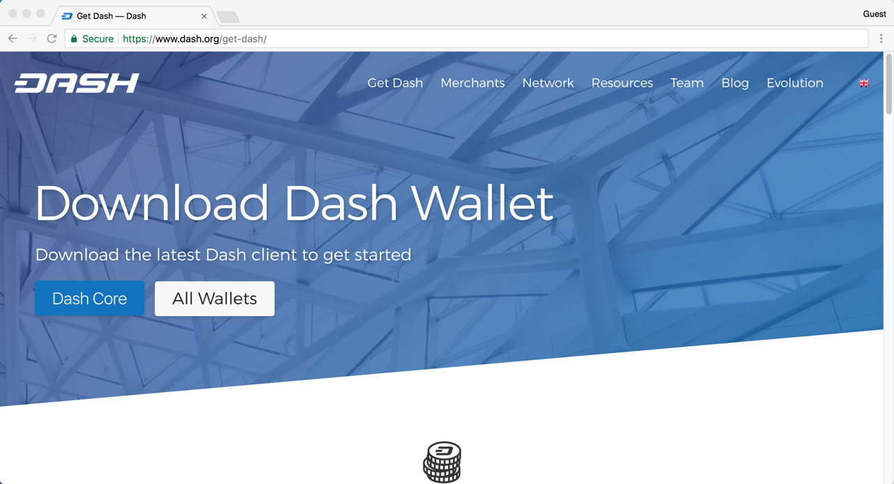

   The website properly detects the wallet appropriate for your system

If detection does not work, you will need to manually choose your
operating system. Go to https://www.axerunners.com/wallets and select the 
**OSX** tab, then click **Download DMG**.

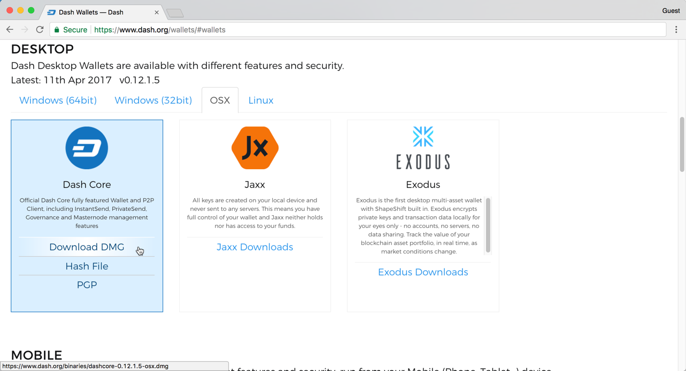

   Manually selecting and downloading an installer

Save the file you downloaded to your Downloads folder.

Verifying Axe Core
-------------------

This step is optional, but recommended to verify the integrity of the
file you downloaded. This is done by checking its SHA256 hash against
the hash published by the Axe Core development team. To view the
published hash, click the **Hash file** button on the wallet download
page.

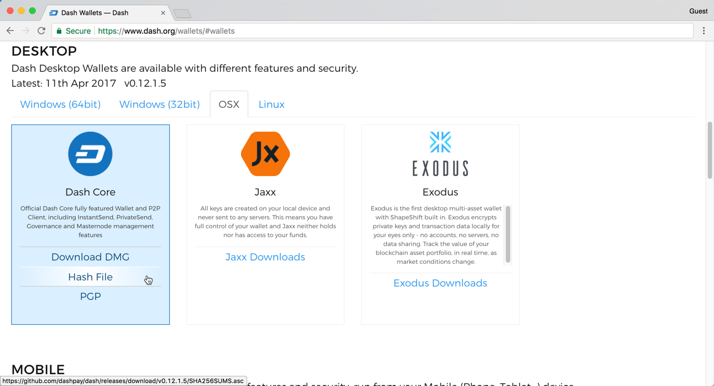

   Downloading the Axe Core hash file

Once both the Axe Core file and the hash file have downloaded,
double-click the hash file or view it in your browser and find the hash
value for the Axe Core file you downloaded.

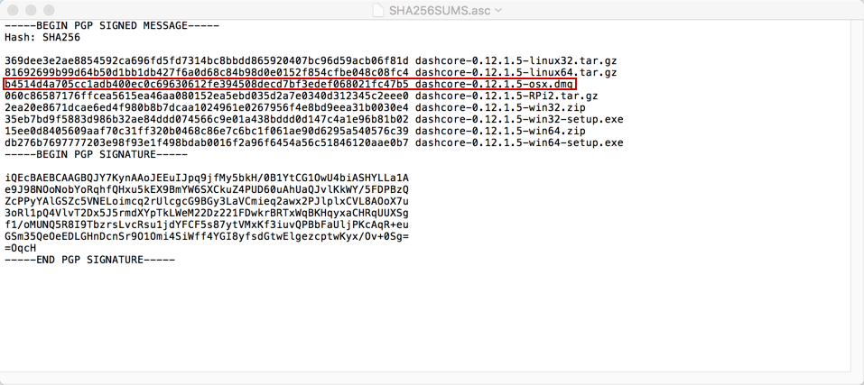

   Viewing the Axe Core hash file

This hash value should correspond with the hash value of the file you
have downloaded to ensure it is authentic and was not corrupted during
transit. To do this, open **Terminal**, browse to the location where you
saved the file, and run the following command, replacing the version
with the specific version of the file you downloaded::

   shasum -a 256 axecore-version-osx.dmg

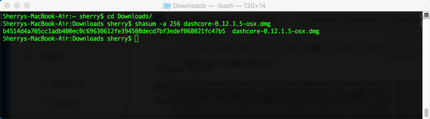

   Generating an SHA256 hash for the downloaded file

If the hashes match, then you have an authentic copy of Axe Core for
macOS.

Installing Axe Core
--------------------

Open Finder and browse to your Downloads folder. Then double-click on
the .dmg file you downloaded to decompress it. A window appears showing
the contents of the file.

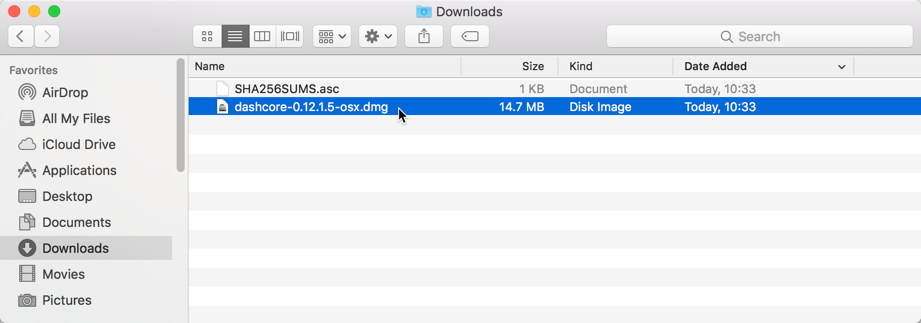

   Opening the Axe Core .dmg file

Drag the Axe Core application file into your Applications folder to
install Axe Core.

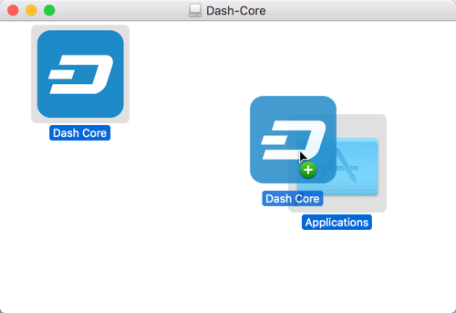

   Installing Axe Core

Running Axe Core for the first time
------------------------------------

To run Axe Core for the first time, either open Launchpad or browse to
your **Applications** folder in Finder. Double-click **Axe Core** or
**Axe-Qt** to start the application. You may see a warning about
opening an app from an unidentified developer. To resolve this problem,
simply Control-click the app icon and choose **Open** from the shortcut
menu, then click **Open** again in the dialog box. The app is saved as
an exception to your security settings, and you can open it in the
future by double-clicking it just as you can any registered app.

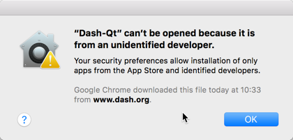

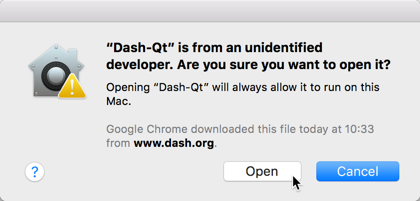

   Unblocking macOS from running Axe Core

The first time the program is launched, you will be offered a choice of
where you want to store your blockchain and wallet data. Choose a
location with enough free space, as the blockchain can reach 10GB+ in
size. It is recommended to use the default data folder if possible.

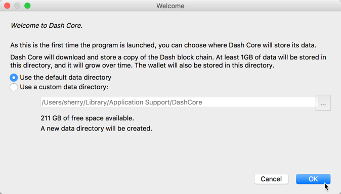

   Choosing the Axe Core data folder

Axe Core will then start up. This will take a little longer than usual
the first time you run it, since Axe Core needs to generate
cryptographic data to secure your wallet.

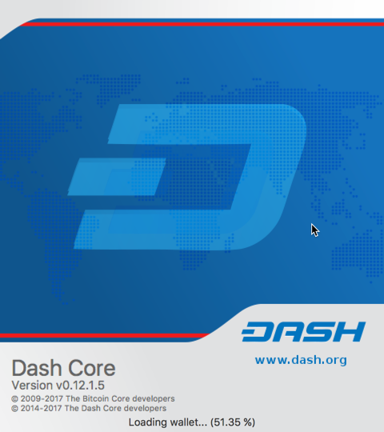

   Starting Axe Core

Synchronizing Axe Core to the Axe network
-------------------------------------------

Once Axe Core is successfully installed and started, you will see the
wallet overview screen. You will notice that the wallet is “out of
sync”, and the status bar at the bottom of the window will show the
synchronization progress.

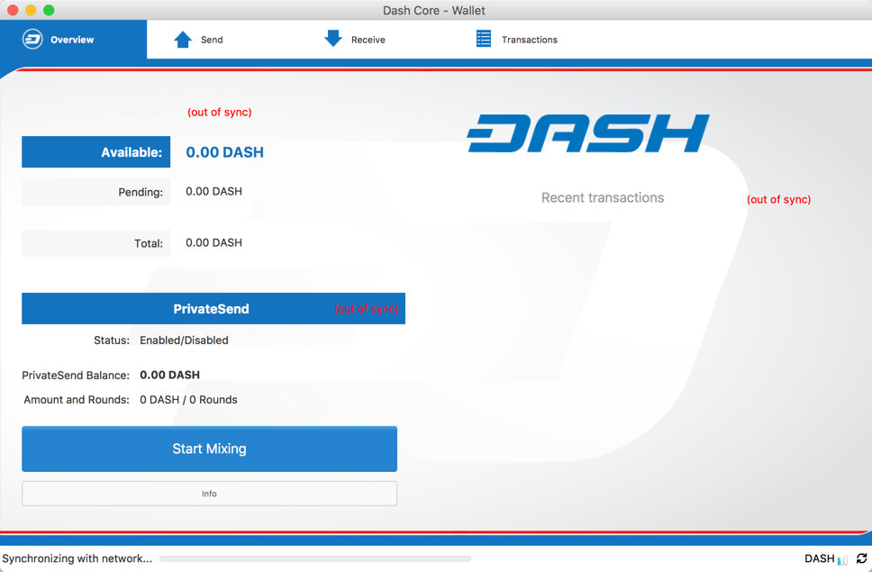

   Axe Core begins synchronizing with the Axe network

During this process, Axe Core will download a full copy of the Axe
blockchain from other nodes to your device. Depending on your internet
connection, this may take a long time. If you see the message “No block
source available”, check your internet connection. When synchronization
is complete, you will see a small blue tick in the lower right corner.

   Axe Core synchronization is complete

You can now begin to use your wallet to send and receive funds.

Encrypting your Axe wallet
---------------------------

After your wallet has synchronized with the Axe network, it is strongly
advised to encrypt the wallet with a password or passphrase to prevent
unauthorized access. You should use a strong, new password that you have
never used somewhere else. Take note of your password and store it
somewhere safe or you will be locked out of your wallet and lose access
to your funds.

To encrypt your wallet, click **Settings** > **Encrypt Wallet**.

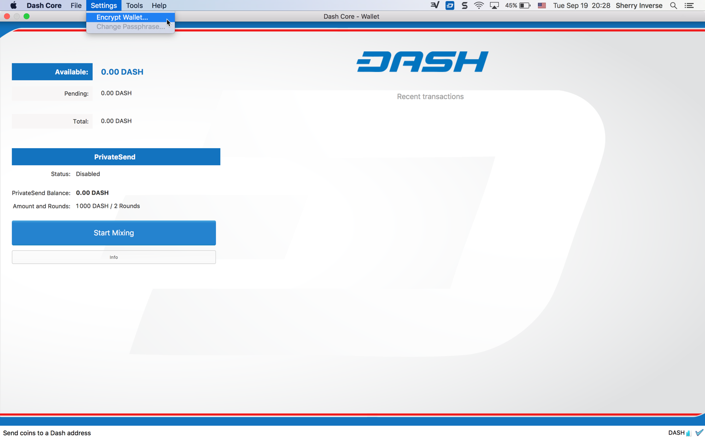

   Encrypting the Axe wallet with a password

You will be asked to enter and verify a password.

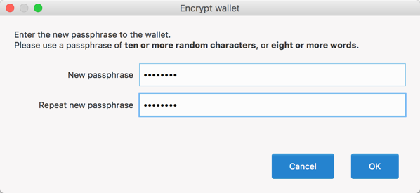

   Enter a password

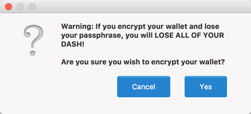

   Confirm you want to encrypt your wallet

When the encryption process is complete, you will see a warning that
past backups of your wallet will no longer be usable, and be asked to
shut down Axe Core. When you restart Axe Core, you will see a small
blue lock in the lower right corner.

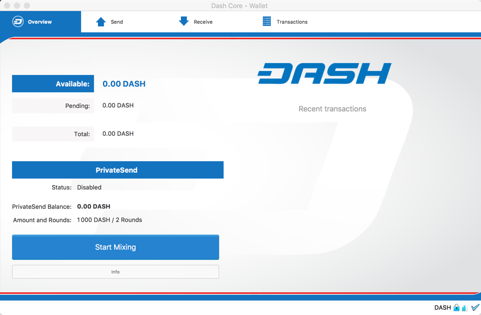

   Fully encrypted and synchronized Axe Core wallet

You can now begin to use your wallet to safely send and receive funds.
