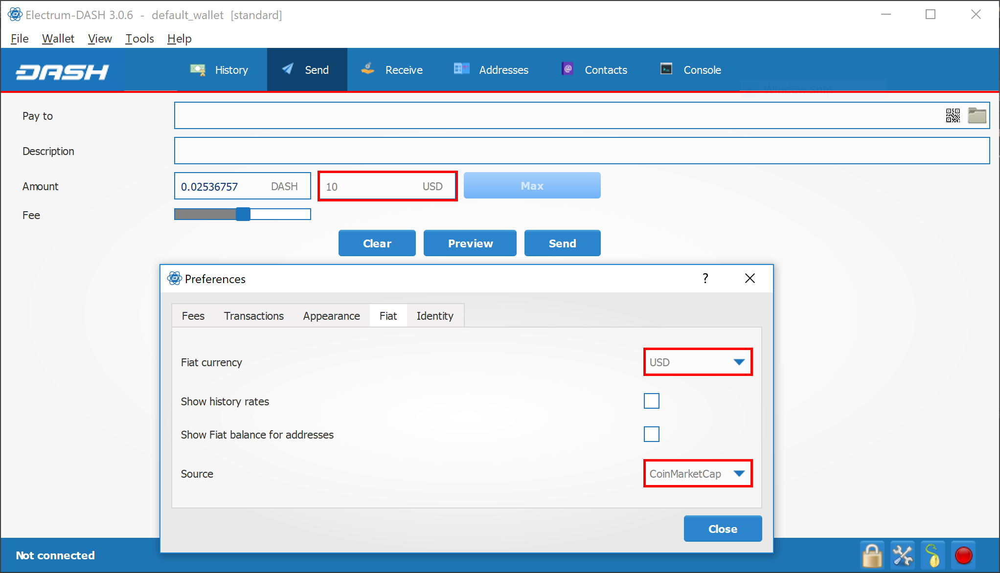

.. meta::
   :description: Frequently Asked Questions about the Axe Electrum wallet
   :keywords: axe, wallet, electrum, faq, seed

.. _electrum-faq:

==========================
Frequently Asked Questions
==========================

How does Axe Electrum work?
----------------------------

Axe Electrum focuses on speed, low resource usage and providing a
simple user experience for Axe. Startup times are instant because it
operates in conjunction with high-performance servers that handle the
most complicated parts of the Axe system.

Does Axe Electrum trust servers?
---------------------------------

Not really; the Axe Electrum client never sends private keys to the
servers. In addition, it verifies the information reported by
servers using a technique called `Simple Payment Verification
<http://docs.electrum.org/en/latest/spv.html>`_.

What is the Seed?
-----------------

The seed is a random phrase that is used to generate your private keys.
Example::

  constant forest adore false green weave stop guy fur freeze giggle clock

Your wallet can be entirely recovered from its seed. To do this, select
the **I already have a seed** option during startup.

How secure is the seed?
-----------------------

The seed created by Axe Electrum has 128 bits of entropy. This means
that it provides the same level of security as a Axe private key (of
length 256 bits). Indeed, an elliptic curve key of length n provides n/2
bits of security.

What are change addresses?
--------------------------

The Axe Electrum wallet design and workflow are based on a concept
called a “wallet generation seed”. This seed is a unique, randomly-
selected list of twelve words. A Axe Electrum wallet uses its seed as a
template for generating addresses.

To understand the problem that seeds solve, browse to the Electrum
**Receive** tab. Next, open the collapsible entry marked **Change**.

   Receiving and change addresses in Axe Electrum

Notice that the total balance does not only show the sum of all
receiving addresses, but also the separately listed **Change**
addresses. Where did these new change addresses come from and why does
the first one now hold funds?

Axe is an electronic cash system, meaning that it shares much in common
with the process of using paper banknotes. Although some cash payments
involve exact change, many do not. You tend to “overpay” when using
cash, and expect to receive the difference as change. Perhaps
surprisingly, this is how Axe transactions work as well. If the entire
balance of an address is not required for any given transaction, the
remainder is sent to a new and unused address under control of the same
wallet. This address is generated deterministically (rather than
randomly) from the wallet seed, which means that any other wallet will
also regenerate the change addresses in the same order from the same
recovery seed, and have access to the balances.

Spending the entire balance and sending any remainder to a change
address is considered good practice because it prevents the transaction
recipient from linking transactions by browsing the blockchain, thus
compromising your privacy. If privacy is not a concern, change addresses
can be disabled via the **Tools > Electrum preferences** menu option.

How can I send the maximum available in my wallet?
--------------------------------------------------

Type an exclamation mark (!) in the **Amount** field or simply click the
**Max** button. The fee will be automatically adjusted for that amount.

How can I send Axe without paying a transaction fee?
-----------------------------------------------------

You can create a zero fee transaction in the GUI by following these
steps:

-  Enable the **Edit fees manually** option
-  Enter 0 in the **Fee** field
-  Enter the amount in the **Amount** field

Note that transactions without fees might not be relayed by the Axe
Electrum server, or by the Axe network.

Is there a way to enter amounts in USD in Axe Electrum?
--------------------------------------------------------

Yes, go to **Tools > Prefernce > Fiat** and select a **Fiat currency**
to display the current exchange rate from the chosen **Source**.

   Entering values in fiat currency in Axe Electrum

What does it mean to “Freeze” an address in Axe Electrum?
----------------------------------------------------------

When you freeze an address, the funds in that address will not be used
for sending Axe. You cannot send Axe if you don’t have enough funds
in your non-frozen addresses.

How is the wallet encrypted?
----------------------------

Axe Electrum uses two separate levels of encryption:

 - Your seed and private keys are encrypted using AES-256-CBC. The
   private keys are decrypted only briefly, when you need to sign a
   transaction; for this you need to enter your password. This is done
   in order to minimize the amount of time during which sensitive
   information is unencrypted in your computer's memory.

 - In addition, your wallet file may be encrypted on disk. Note that the
   wallet information will remain unencrypted in the memory of your
   computer for the duration of your session. If a wallet is encrypted,
   then its password will be required in order to open it. Note that the
   password will not be kept in memory; Axe Electrum does not need it
   in order to save the wallet on disk, because it uses asymmetric
   encryption (ECIES).

Wallet file encryption is activated by default since version 2.8. It is
intended to protect your privacy, but also to prevent you from
requesting Axe on a wallet that you do not control.

I have forgotten my password but still have my seed. Is there any way I can recover my password?
------------------------------------------------------------------------------------------------

It is not possible to recover your password. However, you can restore
your wallet from its seed phrase and choose a new password. If you lose
both your password and your seed, there is no way to recover your money.
This is why we ask you to save your seed phrase on paper.

To restore your wallet from its seed phrase, create a new wallet, select
the type, choose **I already have a seed** and proceed to input your
seed phrase.

Does Axe Electrum support cold wallets?
----------------------------------------

Yes. See the :ref:`cold storage <electrum-cold-storage>` section.

Can I import private keys from other Axe clients?
--------------------------------------------------

In Axe Electrum 2.0, you cannot import private keys in a wallet that
has a seed. You should sweep them instead.

If you want to import private keys and not sweep them you need to create
a special wallet that does not have a seed. For this, create a new
wallet, select **Use public or private keys**, and instead of typing
your seed, type a list of private keys, or a list of addresses if you
want to create a watching-only wallet. A master public (xpub) or private
(xprv) will also work to import a hierarchical deterministic series of
keys. You will need to back up this wallet, because it cannot be
recovered from seed.

.. figure:: img/faq-xpub.png
   :width: 400px

   Importing a list of private keys to create a wallet

Can I sweep private keys from other Axe clients?
-------------------------------------------------

Sweeping private keys means to send all the Axe they control to an
existing address in your wallet. The private keys you sweep do not
become a part of your wallet. Instead, all the Axe they control are
sent to an address that has been deterministically generated from your
wallet seed.

To sweep private keys go to **Wallet > Private Keys > Sweep**. Enter the
private keys in the appropriate field. Leave the **Address** field
unchanged. This is the destination address from your existing Axe
Electrum wallet. Click on **Sweep**. Axe Electrum then takes you to the
**Send** tab where you can set an appropriate fee and then click on
**Send** to send the coins to your wallet.

Where is my wallet file located?
--------------------------------

The default wallet file is called default_wallet and is created when you
first run the application. It is located under the `/wallets` folder.

- **Linux:** Open Files, select **Go > Go to folder**, copy the path 
  ``~/.electrum-axe`` and paste it into the dialog box
- **macOS:** Open Finder, select **Go > Go to Folder**, copy the path
  ``~/.electrum-axe`` and paste it into the dialog box
- **Windows:** Open Explorer, copy the path ``%APPDATA%\Electrum-AXE``
  and paste it in to the address bar

Can I do bulk payments with Axe Electrum?
------------------------------------------

You can create a transaction with several outputs. In the GUI, type each
address and amount on a line, separated by a comma.

.. figure:: img/faq-paytomany.png
   :width: 400px

   Creating a transaction with multiple outputs in Axe Electrum

Amounts are in the current unit set in the client. The total is shown in
the GUI. You can also import a CSV file in the **Pay to** field by
clicking on the folder icon.

Can Axe Electrum create and sign raw transactions?
---------------------------------------------------

Axe Electrum lets you create and sign raw transactions right from the
user interface using a form.

Axe Electrum freezes when I try to send Axe
---------------------------------------------

This might happen if you are trying to spend a large number of
transactions outputs (for example, if you have collected hundreds of
donations from a Axe faucet). When you send Axe, Axe Electrum looks
for unspent coins that are in your wallet in order to create the new
transaction. Unspent coins can have different values, much like physical
coins and bills.

If this happens, you should consolidate your transaction inputs by
sending smaller amounts of Axe to one of your wallet addresses; this
would be the equivalent of exchanging a stack of nickels for a dollar
bill.

.. _gap limit:

What is the gap limit?
----------------------

The gap limit is the maximum number of consecutive unused addresses in
your deterministic sequence of addresses. Axe Electrum uses it in order
to stop looking for addresses. In Axe Electrum 2.0, it is set to 20 by
default, so the client will get all addresses until 20 unused addresses
are found.

How can I pre-generate new addresses?
-------------------------------------

Axe Electrum will generate new addresses as you use them, until it hits
the `gap limit`_.

If you need to pre-generate more addresses, you can do so by typing
wallet.create_new_address() in the console. This command will generate
one new address. Note that the address will be shown with a red
background in the address tab, to indicate that it is beyond the gap
limit. The red color will remain until the gap is filled.

WARNING: Addresses beyond the gap limit will not automatically be
recovered from seed. To recover them will require either increasing the
client’s gap limit or generating new addresses until the used addresses
are found.

If you wish to generate more than one address, you may use a ‘for’ loop.
For example, if you wanted to generate 50 addresses, you could do this::

  for x in range(0, 50):
    print wallet.create_new_address()

How to upgrade Axe Electrum?
-----------------------------

Warning: always save your wallet seed on paper before doing an upgrade.

To upgrade Axe Electrum, just :ref:`install <electrum-installation>`
the most recent version. The way to do this will depend on your OS. Note
that your wallet files are stored separately from the software, so you
can safely remove the old version of the software if your OS does not do
it for you.

Some Axe Electrum upgrades will modify the format of your wallet files.
For this reason, it is not recommended to downgrade Axe Electrum to an
older version once you have opened your wallet file with the new
version. The older version will not always be able to read the new
wallet file.

The following issues should be considered when upgrading Axe Electrum
1.x wallets to Axe Electrum 2.x:

- Axe Electrum 2.x will need to regenerate all of your addresses during
  the upgrade process. Please allow it time to complete, and expect it
  to take a little longer than usual for Axe Electrum to be ready.

- The contents of your wallet file will be replaced with a Axe
  Electrum 2 wallet. This means Axe Electrum 1.x will no longer be able
  to use your wallet once the upgrade is complete.

- The **Addresses** tab will not show any addresses the first time you
  launch Axe Electrum 2. This is expected behaviour. Restart Axe
  Electrum 2 after the upgrade is complete and your addresses will be
  available.

- Offline copies of Axe Electrum will not show the addresses at all
  because it cannot synchronize with the network. You can force an
  offline generation of a few addresses by typing the following into the
  Console: `wallet.synchronize()`. When it’s complete, restart Axe
  Electrum and your addresses will once again be available.

