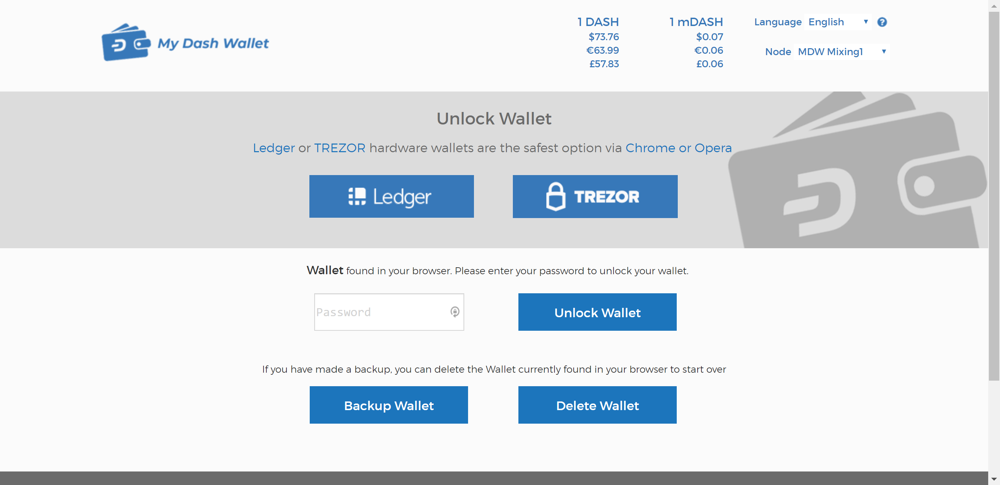
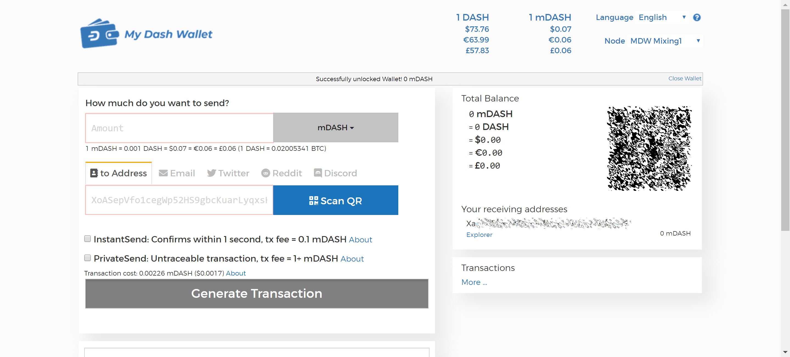

.. meta::
   :description: MyAxeWallet is a secure web wallet for Axe, supporting InstantSend and PrivateSend
   :keywords: axe, myaxewallet, web, wallet, privatesend, instantsend, my axe wallet

.. _axe-web-wallet:

MyAxeWallet
============

.. image:: img/myaxewallet.png
   :width: 120px
   :align: right

`MyAxeWallet <https://myaxewallet.org/>`_ is a web interface to the
Axe blockchain, inspired by `MyEtherWallet
<https://www.myetherwallet.com>`_ and created by `DeltaEngine.net
<https://deltaengine.net/>`_. It is explicitly not an online wallet,
meaning you maintain control over your private keys at all times. Unlike
many other light wallets, MyAxeWallet also supports advanced Axe
features such as InstantSend and PrivateSend. The project is non-profit,
open source and free to use. You can load a wallet and transact in a
variety of wallet formats:

- Keystore wallet (file-based)
- Ledger hardware wallet
- Trezor hardware wallet
- Private key
- BIP39/44 HD recovery phrase (coming soon)
- BIP32 HD recovery phrase (coming soon)

MyAxeWallet offers complete and detailed documentation for all functions.

- `Getting started <https://myaxewallet.org/About>`_
- `How to Create a Wallet via Keystore file <https://myaxewallet.org/AboutCreateNewWallet>`_
- `Using the Ledger Hardware Wallet on MyAxeWallet <https://myaxewallet.org/AboutLedgerHardwareWallet>`_
- `Using the Trezor Hardware Wallet on MyAxeWallet <https://myaxewallet.org/AboutTrezorHardwareWallet>`_
- `How to does AXE InstantSend work on MyAxeWallet? <https://myaxewallet.org/AboutInstantSend>`_
- `How to does AXE PrivateSend work on MyAxeWallet? <https://myaxewallet.org/AboutPrivateSend>`_

